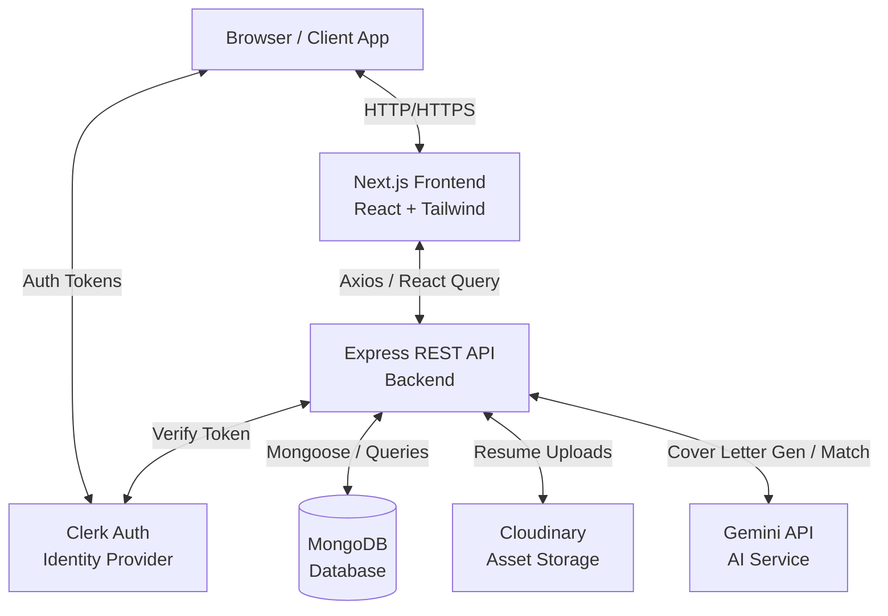
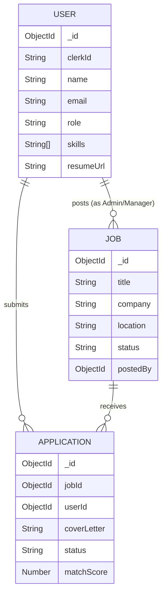

# AI Job Finder - System Architecture

## 1. High-Level Architecture Diagram

### Components
1. **Frontend (Next.js)**: Handles the UI, routing, state management via TanStack React Query, and directly interacts with the backend REST API via Axios. Server actions are intentionally avoided for core business logic in favor of a clear API boundary.
2. **Backend (Express)**: Manages all core business logic, database transactions, AI integrations, and file uploads.
3. **Identity (Clerk)**: Handles user authentication, token issuance, and session management.
4. **Database (MongoDB)**: Stores `User`, `Job`, and `Application` entities.
5. **AI Service (Gemini)**: Provides AI-driven features like Cover Letter generation and resume parsing/matching.
6. **Storage (Cloudinary)**: Securely stores user resumes (PDFs, DOCs).

---

## 2. Business Flow

### 2.1. Candidate (User) Flow
1. **Discovery**: Visitor browses the landing page and views public job listings.
2. **Authentication**: Visitor signs in/up via Clerk to access personalized features.
3. **Profile Setup**: User navigates to their profile to fill in bio, skills, experience, and uploads a resume (stored in Cloudinary).
4. **Job Search**: User filters and searches for jobs based on title, location, or skills.
5. **Application**: 
   - User initiates a job application.
   - The backend utilizes the Gemini API to automatically generate a tailored Cover Letter based on the User's profile skills/resume and the Job's requirements.
   - User submits the final application.
6. **Tracking**: User checks the dashboard to track application statuses.

### 2.2. Employer (Admin/Manager) Flow
*(Note: Full admin UI pending implementation, but APIs support the following)*
1. **Authentication**: Employer logs in and is verified as an `ADMIN` or `MANAGER`.
2. **Job Creation**: Employer creates a new job listing with title, salary, skills, and requirements.
3. **Application Review**: Employer views all applications for their posted jobs.
4. **Candidate Matching**: Employer views AI-generated match scores comparing the candidate's resume/skills to the job requirements.
5. **Status Update**: Employer updates the application status to `Reviewed`, `Accepted`, or `Rejected`.

---

## 3. Domain Model Relationships

